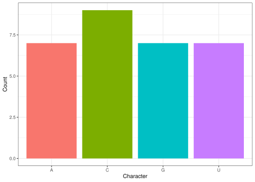

``` r
library(centdog)
```

## Github link

<https://github.com/rforbiodatascience25/group_28_package>

## The Central Dogma

This simple R package is designed to replicate the function of the
**cent**ral **dog**ma of biology, in which one goes from a
double-helixed DNA strand to a complete protein consisting of a string
of amino acids.

A typical use case for this package goes as follows:

### Creating a DNA string

First and foremost you will need a random DNA string to turn into your
final protein. This can be acomplished using the `DNA_creator()`
function. Alternatively you can supply your own DNA string if you have
one handy or wish to translate an actual sequence of DNA to a finished
amino acid sequence.

``` r
# We wish to create a medium sized protein of 10 amino acids, 
# so we need a DNA string consisting of 30 bases
my_DNA <- DNA_creator(30)
my_DNA
#> [1] "TTCCGGACTCCCGCCAATGCTAATGGAGTA"
```

When using the `DNA_creator()` you will need to specify the length of
the sequence you wish to create as it does not have a default value.
Your output sequence will be a random collection of the DNA bases
*ATGC.*

### Translating to RNA

To go from a DNA sequence to a protein it first needs to go through the
interim of being an RNA string. This process is thankfully simple
(code-wise) as the main difference (again only in code) is that all
instances of Thymine (*T*) will be replaced by Uracil (*U*). This can be
done using the `codon_sub()` function.

``` r
# Using the same DNA string from before we will now convert it to RNA
my_RNA <- codon_sub(my_DNA)
my_RNA
#> [1] "UUCCGGACUCCCGCCAAUGCUAAUGGAGUA"
```

If you forgot to do this step before splitting your sequence into codons
fret not as it can also handle transforming your codons and removing
those pesky Thymines!

### RNA statistics

Before splitting into codons you might find it interesting to take a
closer look at the distribution of the different bases across your RNA
string. This can be done using the `plot_base_counts()` function, which
calculates the occurrences of each base and plots it nicely using the
`ggplot2` package (hence the dependency).

``` r
my_plot <- plot_base_counts(my_RNA)
my_plot
```

<!-- -->

### Splitting into codons

Now that we have a simulated RNA string it is time to split it into
codons (ie. pairs of 3 bases) which is necesarry before it can be
translated into amino acids. To do this we turn to the trusty
`extract_codons()` function, which as the name implies, splits our RNA
string into codons.

``` r
# It is unnecesarry to specify the starting position if you simply wish to start reading
# from the start of the sequence as it defaults to 1. 
# It is included here for the sake of clarity
my_codons <- extract_codons(my_RNA, start = 1)
my_codons
#>  [1] "UUC" "CGG" "ACU" "CCC" "GCC" "AAU" "GCU" "AAU" "GGA" "GUA"
```

This functions is quite neat as it can also shift the reading frame of
your sequence should you so desire, by simply changing the *start*
position accordingly.

### Translating from RNA codons to amino acids

It is now the moment we have all been waiting for; translating the RNA
sequence directly into a string of amino acids, thus creating a protein!
For this step it is necesarry that your string is converted into RNA and
that it is split into codons as those sets of 3 are essential for
translation. We will be using the aptly named `RNA_to_aa_trans()`
function for our translation needs, which comes pre-loaded with a
complete codon to amino acid translation table.

``` r
my_protein <- RNA_to_aa_trans(my_codons)
my_protein
#> [1] "FRTPANANGV"
```

Congratulations! You have now done a biology and succesfully created
your first protein. This concludes the central dogma of biology in this
R package.

## Use cases and discussion

While the package is overall simple, it is still powerful in its own
right as it can slot into essentially any biological workflow, even if
just for the use of a single function.

Creating randomised DNA strings can be extremely helpful for testing
purposes in conjunction with other programs as you sometimes need to
verify if your nice and clean script can handle random input.

The same can be said for the pipeline translating from RNA string
directly to finished protein as it can be extremely helpful to have a
direct translation should you wish to study proteins directly with only
a series of sequences given.

Lastly the `plot_base_counts()` function can help with statistics across
large sequences as it can immediately help figure out distributions and
make comparisons across sequences nice and manageable.

### Discussion

**Q3)** Adding too many dependencies can quickly become a slippery slope
as suddenly the “cost” of importing your package can balloon massively
and what seems like a small and quick solution to a problem suddenly
imports an extra 5 packages, that might require installation as well.
This can result in your package becoming largely unusable or simply
causing users to program their own functions instead to avoid the
massive package bloat.

**Q4)** If you’re using `@importFrom package function` instead of
`package::function()` then you might end up accidentally overriding
pre-existing functions that exist either as part of a different package
or as part of base R. Should you end up doing so then there is no way
for you to know unless you suddenly find that the function you’re
calling does the wrong thing compared to normal. Using
`package::function()` saves you from this headache as it is abundantly
clear both which package you’re using and which intended function from
said package you’re calling.
